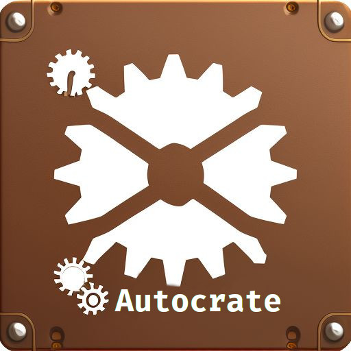

# Autocrate



**Disclaimer**: I've generated the Readme and logo with the help of so called AI
tools and modified them afterwards.

Autocrate simplifies the creation and maintenance of releases for your Rust
projects hosted on Gitea servers. By providing essential functionalities
like uploading artifacts, publishing crates, and managing changelogs,
Autocrate streamlines the release process, allowing developers to focus on
their work. Although initially built for Gitea, we plan to extend support
for additional platforms such as GitHub and GitLab.


[](https://github.com/PlexSheep/Autocrate/actions/workflows/cargo.yaml)

* [Original Repository](https://git.cscherr.de/PlexSheep/Autocrate)
* [GitHub Mirror](https://github.com/PlexSheep/Autocrate)


## Features

* Create and update releases on your Gitea server
* Publish crates to Cargo.rs
or other repositories directly from your Rust projects
* Upload artifacts, including documentation and binaries, alongside your releases
* Generate and maintain changelogs and release notes.

### Upcoming Features

My goal is to continuously enhance Autocrate to better serve the developer
community. Some planned improvements include supporting other popular hosting
platforms, enabling even greater flexibility and convenience.

## Getting Started

Before getting started with Autocrate, make sure you have the necessary
prerequisites covered:

* **A Rust Environment**: Install the latest stable Rust compiler and
associated tools via the official website: <https://www.rust-lang.org/>
* **Access to a Gitea Server** (such as [git.cscherr.de](https://git.cscherr.de)
and [codeberg.org](https://codeberg.org) (strictly speaking, uses a Gitea fork)

### Installing

Once the above pre-requisites are met, begin setting up Autocrate by running
the following command in your terminal:

``` $ cargo install autocrate ```

This command downloads from [crates.io](https://crates.io) and compiles Autocrate
locally, making it readily accessible through your command line interfaces.

### Configuring Autocrate

Create a TOML file named `.autocrate.yaml` in the root of your Git repository.
It should contain the following parameters (replace the placeholders):

| Parent  | Key          | Value                                                                            | Explanation                                                                  |
|---------|--------------|----------------------------------------------------------------------------------|------------------------------------------------------------------------------|
| (root)  | `git-log`    | `true`/`false`                                                                   | should a changelog be generated with `git log`?                              |
| (root)  | `uses`       | keys with this as parent (f.e. `cargo`                                           | Marks features to be used by Autocrate                                       |
| `uses`  | `cargo`      | tells us that your project uses cargo                                            | tells us that your project uses cargo                                        |
| `cargo` | `publish`    | `true`/`false`                                                                   | should we publish crates?                                                    |
| `cargo` | `registries` | registries see [this](https://doc.rust-lang.org/cargo/reference/registries.html) | A list of registries we should publish to. If empty defaults to `crates.io`. |

## Using Autocrate

TBD

## Licensing

Autocrate is free software.

The Autocrate project is distributed under the terms of the GPL-3
License. Please refer to [`LICENSE`](./LICENSE) for complete licensing details.

## Project status

The project has started recently and is currently in pre-alpha.
